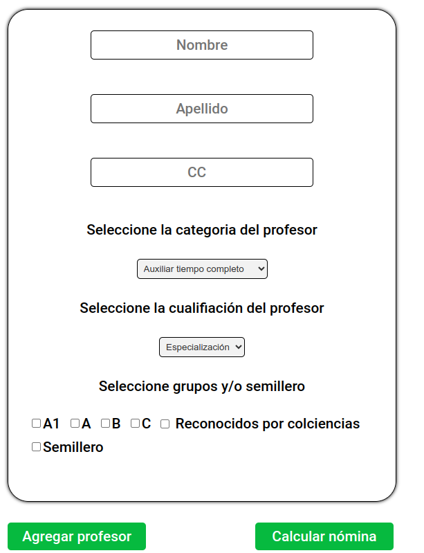

#Nómina UPC

Este es un proyecto de Nómina para la UPC (Universidad Popular del Cesar). Permite gestionar la información de los profesores y calcular la nómina de manera sencilla.

##Instrucciones
Formulario: Aquí se deben llenar los campos obligatorios para agregar un profesor.

Nombre: Nombre del profesor.
Apellido: Apellido del profesor.
Cédula: Número de cédula del profesor.
Categoria: Categoria del profesor
Cualificacion: Cualificacion del profesor
Grupos de investigacion

Una vez llenados todos los campos obligatorios, haz clic en el botón "Agregar Profesor" para guardar la información del profesor en la base de datos.

Después de agregar uno o más profesores, puedes calcular la nómina total haciendo clic en el botón "Calcular Nómina". Este te dará el monto total de la nómina de todos los profesores registrados.

Si la página se recarga o cierras el navegador, no te preocupes, los datos se guardarán automáticamente en la base de datos. Puedes recuperarlos en cualquier momento haciendo clic en el botón "Mostrar Empleados".

